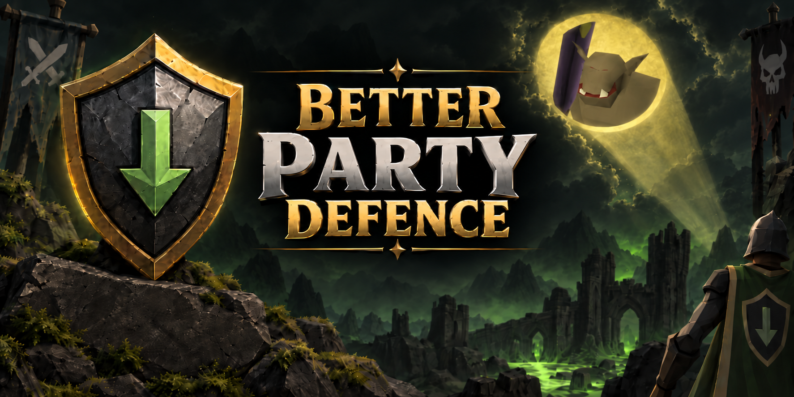



# Better Party Defence

Better Party Defence tracks the estimated live Defence of supported bosses and NPCs after defence-draining special attacks.

The plugin works locally on its own and can also combine special attacks from other players in the same Hub Party.

## Party support

Better Party Defence uses the same RuneLite `PartyService` session used by Hub Party Panel.

It does not create a separate party system, use OSParty networking, or require RuneLite's built-in Party sidebar.

Your own supported special attacks are detected directly by Better Party Defence, so RuneLite's Special Attack Counter does not need to be enabled for local tracking.

For other party members:

* Players using Better Party Defence can share supported defence drains with each other.
* Players using RuneLite's Special Attack Counter can also contribute through its standard `SpecialCounterUpdate` party messages.
* Players using Hub Party Panel can contribute special attack information if RuneLite's Special Attack Counter is enabled.

Local tracking continues to work normally when you are not in a party.

## Display

Better Party Defence can display the current estimated Defence directly on supported NPCs and through an InfoBox for magic, and an infobox for melee.

Display options include attached and detached layouts, configurable fonts and sizing, skill icons, Defence formatting, and it ships by default by hiding conflicting infoboxes.

Magic Defence is tracked separately where supported and can use its own InfoBox.

## Party sync

Better Party Defence includes optional party synchronization for players using the plugin together.

Sync allows current Defence state to be shared between supported clients instead of relying only on individual special attack events. This helps with situations such as players entering an encounter late, temporarily losing sight of a target, or returning to a raid after dying.

Raid state is kept separate between different raid instances, even when players are members of the same Hub Party.

Party synchronization can be disabled from the plugin settings without affecting normal local tracking.

## Supported special attacks

* Dragon Warhammer
* Elder Maul
* Bandos Godsword
* Arclight / Darklight
* Emberlight
* Barrelchest Anchor
* Bone Dagger
* Dorgeshuun Crossbow
* Accursed Sceptre
* Tonalztics of Ralos
* Seercull
* Eye of Ayak

## Multi-target encounters

The tracker can retain Defence state for multiple supported targets during the same encounter.

This is useful for encounters such as Olm where different targets may be drained independently. Switching targets does not discard the previously tracked Defence or special attack history.

## Attribution

Boss stat data and defence-drain calculations were derived from OSParty code supplied with the original project.

Local special attack detection follows RuneLite's Special Attack Counter event model, reduced to the functionality required for defence-draining weapons.

See `ATTRIBUTION.md` and `LICENSE-OSPARTY.txt` for additional information and licensing.

## Supported bosses

Better Party Defence currently supports the following bosses and encounter targets.

### Chambers of Xeric

- Abyssal Portal / Vespula Portal
- Deathly Mage
- Deathly Ranger
- Great Olm
- Great Olm Left Claw
- Great Olm Right Claw
- Ice Demon
- Lizardman Shaman
- Skeletal Mystic
- Tekton
- Tekton (Enraged)
- Vasa Nistirio

### Theatre of Blood

- The Maiden of Sugadinti
- Pestilent Bloat
- Nylocas Vasilias
- Sotetseg
- Xarpus
- Verzik Vitur

### Tombs of Amascut

- Akkha
- Akkha's Shadow
- Ba-Ba
- Core
- Elidinis' Warden
- Kephri
- Obelisk
- Tumeken's Warden
- Zebak

### Other bosses

- Abyssal Sire
- Alchemical Hydra
- Araxxor
- Artio
- Callisto
- Calvar'ion
- Cerberus
- Chaos Elemental
- Commander Zilyana
- Corporeal Beast
- Dagannoth Prime
- Dagannoth Rex
- Dagannoth Supreme
- General Graardor
- Giant Mole
- Kalphite Queen
- King Black Dragon
- Kree'arra
- K'ril Tsutsaroth
- Nex
- Phantom Muspah
- Phosani's Nightmare
- Sarachnis
- Scorpia
- Skotizo
- Spindel
- The Hueycoatl
- The Nightmare
- TzKal-Zuk
- TzTok-Jad
- Vardorvis
- Venenatis
- Vet'ion
- Vorkath
- Yama
- Zulrah

## Not currently supported

Some bosses and encounters are not currently supported by the Defence tracker.

Notable examples include:

- Duke Sucellus
- The Leviathan
- The Whisperer
- Scurrius
- Moons of Peril
- Royal Titans
- Chambers of Xeric Guardians
- Muttadiles
- Vanguards

Support may be expanded where reliable Defence-drain tracking is applicable.

## Experimental features

 These work well enough to ship on by default, although may still have untested edge cases. 
 In current use they are working as intended, but additional real-world testing may uncover situations that still need refinement.

 
  